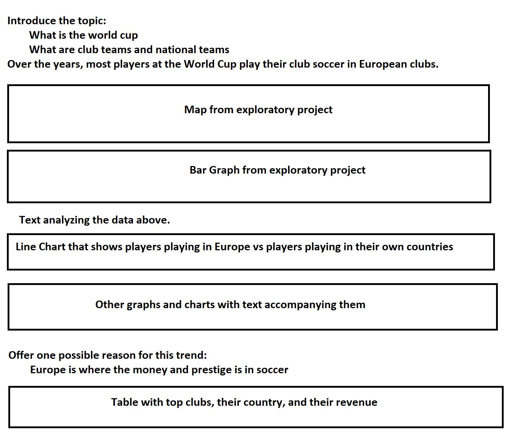

# Prospectus

This project is an extension of my exploratory project (https://github.com/rhossain23/worldCupCountries/). While I was doing that project, I noticed that when the World Cup started back in 1930, most players played their club soccer in the nation that they represented. This was true for most of the early years of the tournament. Over time, however, I noticed that many of the players at the World Cup started playing their club soccer in Europe, regardless of what country they represented in the tournament. The goal of this project is to explore this trend. 

I will begin by giving a brief rundown of how soccer works, such as clubs, national teams, the world cup itself, etc. Then, generally speaking, I'll be adding my visualizations and analyzing them. I am planning on looking at the various clubs that are represented at the World Cup, and I will also see if any of the players changed clubs in between tournaments. I will be using the graphs that I made for the exploratory project, as well as adding new ones. One graph that I am planning on including is a line chart with two lines with the x-axis as the year and the y-axis as the amount of players. One line shows players that played their club soccer in the same country they're representing at the world cup and the other line would be players that play club soccer in Europe. In soccer, Europe is where the money and prestige is, so I plan on including data for top European clubs and their revenues to show why playing in Europe is a goal for many players. There are lots of statistical sources for soccer like https://transfermarkt.com and https://whoscored.com, so I'll be using these sources for this project.

# Sketch

